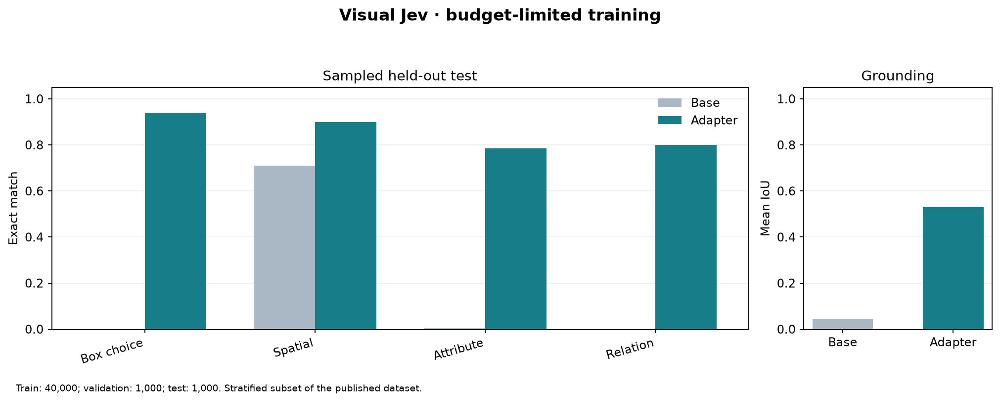

# Visual Jev

Tools for building an image-grounded decision dataset and training Qwen3.5 LoRA adapters. The [published annotation dataset](https://huggingface.co/datasets/harshnandwana/visual-jev-decisions-v1) has 694,255 train, 24,137 validation, and 6,254 test records across five tasks. The dataset and this repository contain **no photo files**. Image references point to COCO 2017; users fetch the photos from the upstream source when needed.

## Repository layout

```text
src/visual_jev/       Installable dataset validator, COCO converter, and HF fetch command
scripts/data/         Full dataset builders and optional Codex SDK candidate generation
scripts/modal/        Modal staging, pilot and budget training, workers, and model publication
scripts/plots/        Local benchmark and pilot plots
tests/                Synthetic fixture and offline tests
docs/                 Data, training, budget, and contribution guides
results/              Measured, photo-free training check outputs
data/                 Local datasets and photos; only small pilot files and the manifest are tracked
```

## Install and fetch annotations

Use Python 3.11 or newer. From the repository root:

```bash
python3 -m venv .venv
.venv/bin/python -m pip install -e . -r requirements.txt
.venv/bin/visual-jev-fetch --output data/hf_release
.venv/bin/visual-jev-data stats data/hf_release/train.jsonl
.venv/bin/visual-jev-data validate data/hf_release/validation.jsonl
```

`visual-jev-fetch` downloads `train.jsonl`, `validation.jsonl`, `test.jsonl`, `images.jsonl`, and `manifest.json` from the pinned Hugging Face commit. It checks SHA-256 hashes and split row counts. It does **not** download photos or the unreviewed Luna candidates. Pass `--include-candidates` only if you want that separate candidate file. See [the data guide](docs/DATA.md) for record format, upstream sources, and licenses.

The annotation rows use image paths such as `data/coco/train2017/000000000009.jpg`. To fetch the referenced COCO photos into those paths, from the repository root run:

```bash
.venv/bin/visual-jev-data download-images data/hf_release/train.jsonl --workers 12
.venv/bin/visual-jev-data download-images data/hf_release/validation.jsonl --workers 8
.venv/bin/visual-jev-data download-images data/hf_release/test.jsonl --workers 8
.venv/bin/visual-jev-data validate data/hf_release/train.jsonl --check-images
```

The image download is optional for inspecting annotations, but required for local visual training. It downloads from the official COCO image host. Photos stay in the ignored `data/coco/` directory; do not add them to Hugging Face or GitHub. The Modal training scripts stage photos in a private Modal Volume instead.

## Run the code

```bash
.venv/bin/python -m unittest discover -s tests -q
.venv/bin/visual-jev-data build-coco \
  --annotations tests/fixtures/coco_instances.json \
  --images-dir tests/fixtures --source-split train2017 \
  --output /tmp/visual-jev-demo.jsonl
.venv/bin/visual-jev-data validate /tmp/visual-jev-demo.jsonl
```

The fixture is synthetic. To rebuild the full release from raw COCO and Visual Genome annotations, see [the data guide](docs/DATA.md). To run the sampled model pipeline on Modal, see [budget training](docs/BUDGET_TRAINING.md). The [training guide](docs/TRAINING.md) explains the complete dataset pipeline, which requires substantially more compute.

The [budget-limited LoRA model](https://huggingface.co/harshnandwana/visual-jev-budget20-qwen35-0.8b-lora) completed one epoch on **40,000 sampled training records** using two L4 GPUs. It was evaluated on all 1,000 records of the selected validation subset and all 1,000 records of the selected test subset. The [exact metrics](results/budget40k_metrics.json), [benchmark chart](results/budget40k_benchmark.png), and [training details](docs/BUDGET_TRAINING.md) are public. The earlier [256-example check](results/budget_smoke_metrics.json) remains for pipeline reproducibility. The complete 694,255-row training split has **not** been trained or benchmarked.



## Use your own dataset or account

`visual-jev-fetch` defaults to the pinned Visual Jev release. For your own release with the same manifest and record schema, pass `--repo-id your-name/your-dataset --revision COMMIT_SHA`. Configure the Modal scripts before deployment with `VISUAL_JEV_DATASET_REPO`, `VISUAL_JEV_DATASET_REVISION`, `VISUAL_JEV_MODEL_REPO`, and optionally `VISUAL_JEV_MODAL_VOLUME`. The JSONL rows must pass `visual-jev-data validate`; the Modal worker expects image paths relative to its staged data root and the five task names listed in [the data guide](docs/DATA.md). Keep your Hugging Face write token in a Modal secret named `visual-jev-hf-publish` as `HF_TOKEN`, never in source control. Read the [contribution guide](docs/CONTRIBUTING.md) before publishing changes.

The code is licensed under [Apache 2.0](LICENSE). COCO photos, COCO and Visual Genome annotations, and the Qwen base model have their own terms; see [the data guide](docs/DATA.md).
