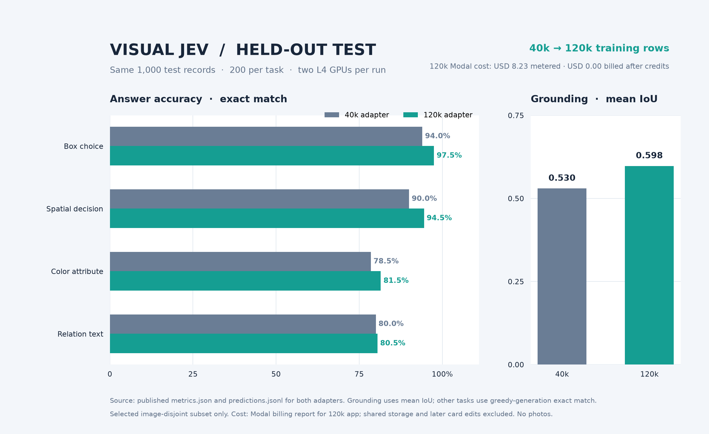
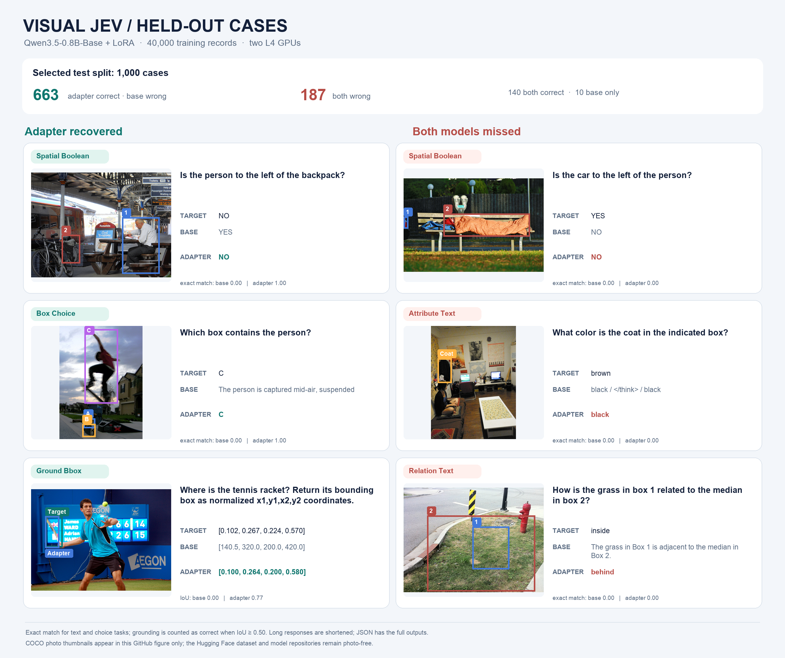

# Visual Jev

Tools for building an image-grounded decision dataset and training Qwen3.5 LoRA adapters. The [published annotation dataset](https://huggingface.co/datasets/harshnandwana/visual-jev-decisions-v1) has 694,255 train, 24,137 validation, and 6,254 test records across five tasks. The dataset and model repositories contain **no photo files**. This GitHub README includes one composite figure with COCO photo thumbnails. Image references point to COCO 2017; users fetch the source photos when needed.

## Repository layout

```text
src/visual_jev/       Installable dataset validator, COCO converter, and HF fetch command
scripts/data/         Full dataset builders and optional Codex SDK candidate generation
scripts/modal/        Modal staging, pilot and budget training, workers, and model publication
scripts/plots/        Local benchmark and pilot plots
tests/                Synthetic fixture and offline tests
docs/                 Data, training, budget, and contribution guides
results/              Measured outputs and a photo-based test comparison figure
data/                 Local datasets and photos; only small pilot files and the manifest are tracked
```

## Install and fetch annotations

Use Python 3.11 or newer. From the repository root:

```bash
python3 -m venv .venv
.venv/bin/python -m pip install -e . -r requirements.txt
.venv/bin/visual-jev-fetch --output data/hf_release
.venv/bin/visual-jev-data stats data/hf_release/train.jsonl
.venv/bin/visual-jev-data validate data/hf_release/validation.jsonl
```

`visual-jev-fetch` downloads `train.jsonl`, `validation.jsonl`, `test.jsonl`, `images.jsonl`, and `manifest.json` from the pinned Hugging Face commit. It checks SHA-256 hashes and split row counts. It does **not** download photos or the unreviewed Luna candidates. Pass `--include-candidates` only if you want that separate candidate file. See [the data guide](docs/DATA.md) for record format, upstream sources, and licenses.

The annotation rows use image paths such as `data/coco/train2017/000000000009.jpg`. To fetch the referenced COCO photos into those paths, from the repository root run:

```bash
.venv/bin/visual-jev-data download-images data/hf_release/train.jsonl --workers 12
.venv/bin/visual-jev-data download-images data/hf_release/validation.jsonl --workers 8
.venv/bin/visual-jev-data download-images data/hf_release/test.jsonl --workers 8
.venv/bin/visual-jev-data validate data/hf_release/train.jsonl --check-images
```

The image download is optional for inspecting annotations, but required for local visual training. It downloads from the official COCO image host. Source photos stay in the ignored `data/coco/` directory; do not add those files to Hugging Face or GitHub. The Modal training scripts stage photos in a private Modal Volume instead.

## Run the code

```bash
.venv/bin/python -m unittest discover -s tests -q
.venv/bin/visual-jev-data build-coco \
  --annotations tests/fixtures/coco_instances.json \
  --images-dir tests/fixtures --source-split train2017 \
  --output /tmp/visual-jev-demo.jsonl
.venv/bin/visual-jev-data validate /tmp/visual-jev-demo.jsonl
```

The fixture is synthetic. To rebuild the full release from raw COCO and Visual Genome annotations, see [the data guide](docs/DATA.md). To run the sampled model pipeline on Modal, see [budget training](docs/BUDGET_TRAINING.md). The [training guide](docs/TRAINING.md) explains the complete dataset pipeline, which requires substantially more compute.

The latest [120k LoRA model](https://huggingface.co/harshnandwana/visual-jev-120k-qwen35-0.8b-lora) completed one epoch on **120,000 sampled training records** using two L4 GPUs. The earlier [40k model](https://huggingface.co/harshnandwana/visual-jev-budget20-qwen35-0.8b-lora) used 40,000 training rows. Both were evaluated on the **same** 1,000 selected validation and 1,000 selected test records; their published prediction logs contain the same 1,000 test IDs. The [120k metrics](results/budget120k_metrics.json), [benchmark chart](results/budget120k_benchmark.png), [40k metrics](results/budget40k_metrics.json), and [training details](docs/BUDGET_TRAINING.md) are public. The complete 694,255-row training split has **not** been trained or benchmarked.

| Selected test task | 40k adapter | 120k adapter | Metric |
| --- | ---: | ---: | --- |
| Ground box | 0.530 | 0.598 | Mean IoU |
| Box choice | 94.0% | 97.5% | Exact match |
| Spatial Boolean | 90.0% | 94.5% | Exact match |
| Attribute text | 78.5% | 81.5% | Exact match |
| Relation text | 80.0% | 80.5% | Exact match |

These are measured on a selected held-out subset, not the complete published test split or new domains.



The 120k experiment's Modal billing report totals **$8.23 metered** for the staging, training, evaluation, and automatic publication apps: $5.87 L4, $1.41 CPU, and $0.95 memory. Workspace credits covered the charge, so the **net amount billed to date is $0.00**. Shared volume storage and later model-card edits are excluded; see the [cost audit](results/budget120k_cost.json).

Run the released adapter on your own local photo:

```bash
python3 -m pip install -r requirements-inference.txt
python3 scripts/infer.py --image example.jpg --task spatial_boolean \
  --question "Is the person to the left of the backpack?"
```

The CLI defaults to the 120k adapter and accepts all five tasks; use `python3 scripts/infer.py --help` for box arguments or `--model harshnandwana/visual-jev-budget20-qwen35-0.8b-lora` to use the 40k adapter. The model cards have full Python examples. Hugging Face currently lists no Inference Provider for these adapters, so their pages have no live browser widget. Your photo stays local when you run the CLI.

For a guided run, [open the Colab notebook](https://colab.research.google.com/github/harshnandwana/grounding-jet/blob/main/notebooks/try_visual_jev.ipynb) and upload your own image to your Google runtime. The Hugging Face “Use this model” PEFT snippet currently loads the text-only Qwen class, so use the model card code, CLI, or notebook for image questions.

## Gradio demo

The [Gradio Space source](space/app.py) includes five task presets on a generated shapes diagram. The presets are input-format demos; they are not benchmark cases, and no photographs are part of the Space source. The [Space publisher](scripts/modal/publish_space.py) uses the `visual-jev-hf-publish` Modal secret and uploads only `README.md`, `app.py`, and `requirements.txt` from `space/` to `harshnandwana/visual-jev-demo`:

```bash
modal run scripts/modal/publish_space.py
```

The Space is **not yet live**. Hugging Face rejected creation on the current account with HTTP 402: CPU Basic Gradio Spaces require PRO. ZeroGPU creation was also rejected because this account is not yet eligible. After the account becomes eligible or has PRO, run the publisher above. It requests CPU Basic by default, which has no hourly hardware charge but can be slow for inference. Change the hardware deliberately if a faster paid setup is desired.

The figure below shows three real cases where the base model failed and the adapter passed, and three where both failed. It includes annotated COCO photo thumbnails in this GitHub repository only. The [companion JSON](results/test_case_examples.json) retains the full predictions; `scripts/plots/plot_test_cases.py` regenerates the figure from local COCO photos and the published test records.



## Use your own dataset or account

`visual-jev-fetch` defaults to the pinned Visual Jev release. For your own release with the same manifest and record schema, pass `--repo-id your-name/your-dataset --revision COMMIT_SHA`. Configure the Modal scripts before deployment with `VISUAL_JEV_DATASET_REPO`, `VISUAL_JEV_DATASET_REVISION`, `VISUAL_JEV_MODEL_REPO`, and optionally `VISUAL_JEV_MODAL_VOLUME`. The JSONL rows must pass `visual-jev-data validate`; the Modal worker expects image paths relative to its staged data root and the five task names listed in [the data guide](docs/DATA.md). Keep your Hugging Face write token in a Modal secret named `visual-jev-hf-publish` as `HF_TOKEN`, never in source control. Read the [contribution guide](docs/CONTRIBUTING.md) before publishing changes.

The code is licensed under [Apache 2.0](LICENSE). COCO photos, COCO and Visual Genome annotations, and the Qwen base model have their own terms; see [the data guide](docs/DATA.md).
