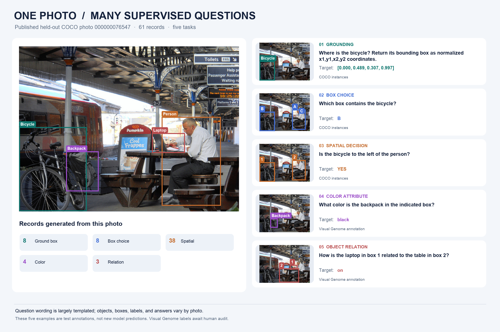

# Dataset and source material

The complete annotation release is [harshnandwana/visual-jev-decisions-v1](https://huggingface.co/datasets/harshnandwana/visual-jev-decisions-v1), pinned in this repository to commit `687c745c34846d104ee85af802b9fd444a854f5d`. Its `manifest.json` lists SHA-256 hashes and task counts. GitHub contains only the small pilot JSONL files and the full release manifest; the full JSONL splits stay on Hugging Face. Source photo files stay outside both releases; GitHub contains a few annotated composites for visual explanation.

| Split | Records | Distinct photos |
| --- | ---: | ---: |
| Train | 694,255 | 95,899 |
| Validation | 24,137 | 3,291 |
| Test | 6,254 | 818 |

The 100,008 distinct photos are from COCO 2017. All records for one photo remain in one split. COCO `train2017` supplies training photos; `val2017` is divided by photo between validation and test. The separate 6,823 Luna candidate records are excluded from those three splits. Hugging Face contains no photo files; this GitHub repository contains small annotated composites for inspection.

## How questions were made

The published train, validation, and test questions use **mostly fixed wording**. Objects, coordinates, candidate boxes, relations, and answers vary with the source annotations. This is supervised training for five defined tasks, not evidence of open-ended question answering. A photo yields only the tasks its annotations support; there is no fixed number of questions per photo.

| Task | Source and selection | Question pattern | Target |
| --- | --- | --- | --- |
| `ground_bbox` | COCO instance box; category appears once in the photo | “Where is the bicycle? Return its bounding box…” | Normalized box |
| `box_choice` | COCO target plus two non-overlapping boxes from other categories; answer position rotates by annotation ID | “Which box contains the bicycle?” | A, B, or C |
| `spatial_boolean` | Two present COCO objects with horizontally separated boxes and a margin | “Is the bicycle to the left of the person?” | YES or NO |
| `attribute_text` | Selected Visual Genome color annotation and indicated region | “What color is the backpack in the indicated box?” | Color word |
| `relation_text` | Selected Visual Genome predicate and two indicated regions | “How is the laptop in box 1 related to the table in box 2?” | Relation word |

The builders normalize boxes, discard ambiguous or invalid source records, retain source annotation IDs and provenance, then package JSONL rows. `build_full_dataset.py` handles the three COCO tasks; `build_vg.py` handles color and relation rows; `package_hf_dataset.py` validates IDs and image-disjoint splits, writes `images.jsonl` with source URLs and licenses, and computes SHA-256 hashes. `luna_candidates.jsonl` contains 6,823 more varied generated choice questions, but they were held out of all published train and evaluation splits pending human review.

This [one-photo example](../results/one_image_dataset.json) has **61 test records**: eight grounding, eight box-choice, 38 spatial, four color, and three relation. The five annotated cards below show one published row per task. The source photo is bundled only inside this GitHub figure; the Hugging Face dataset card links to it externally.



## Sources and attribution

- [COCO 2017](https://cocodataset.org/#download) supplies instance boxes, categories, image metadata, and source photo links. Its [terms of use](https://github.com/cocodataset/cocodataset.github.io/blob/master/dataset/termsofuse.htm) license COCO annotations under CC BY 4.0 and say COCO does not own the photos. Each photo retains its own rights. The released `images.jsonl` records the upstream URL, original Flickr URL, and image license information where available.
- [Visual Genome v1.2](https://visualgenome.org/api/v0/api_readme) supplies selected color attributes and relationships for photos overlapping COCO. Those labels can be noisy and are marked `visual_genome_annotation_pending_audit` in the release. Review its source terms before reusing the annotations.
- `scripts/data/generate_luna.py` uses `gpt-6-luna` through the Codex Python SDK to propose image grounded questions. Another Luna pass checks them; this is not independent human review. The resulting `luna_candidates.jsonl` is a candidate set, not part of training or evaluation.

The code license in [`LICENSE`](../LICENSE) applies to this repository's software and original documentation. It does not relicense third party annotations, photos, or the Qwen base model. The [Qwen3.5-0.8B-Base model card](https://huggingface.co/Qwen/Qwen3.5-0.8B-Base) gives its separate license.

## Record design

`ground_bbox` asks for a normalized `[x1, y1, x2, y2]` box. `box_choice` chooses among visible candidate boxes. `spatial_boolean` asks about clearly separated, present annotated objects. `attribute_text` and `relation_text` use selected Visual Genome labels. Coordinates are normalized to each photo's width and height.

The training input contains the photo, question, offered choices, and any candidate or indicated boxes. The target is the annotated answer. `answer_index`, `answer_box_xyxy`, `answer_text`, `evidence`, and `provenance` must not leak into the input prompt. An absent COCO annotation never becomes evidence that an object is absent. This release does not validate OCR, exhaustive object counts, calibrated UNKNOWN responses, or general out of distribution performance.

## Rebuild layout

The builders expect `data/coco/annotations/instances_train2017.json`, `data/coco/annotations/instances_val2017.json`, COCO photos under `data/coco/train2017/` and `data/coco/val2017/`, and Visual Genome source archives under `data/vg/`. Run the builders in this order:

Install the package first with `python3 -m pip install -e . -r requirements.txt`, and run these commands from the repository root:

```bash
python3 scripts/data/build_full_dataset.py
python3 scripts/data/build_vg.py
python3 scripts/data/package_hf_dataset.py
```

`scripts/data/package_hf_dataset.py` validates rows, checks image disjointness across splits, writes the image license manifest, and reports file hashes. It sets `image_files_included` to `false` by design. To reproduce the published release exactly, use the pinned Hugging Face commit instead of rebuilding from potentially changed upstream files.
